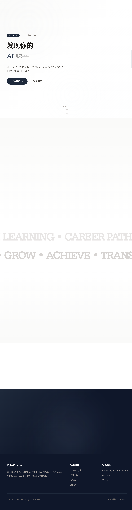
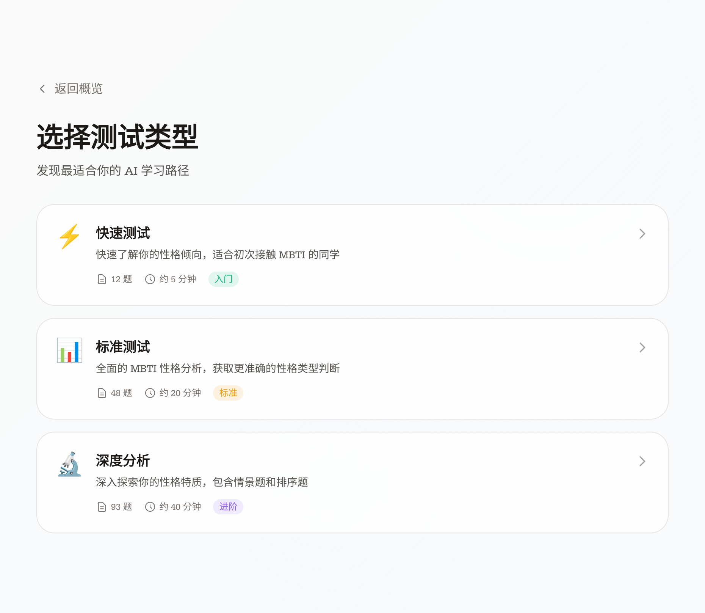
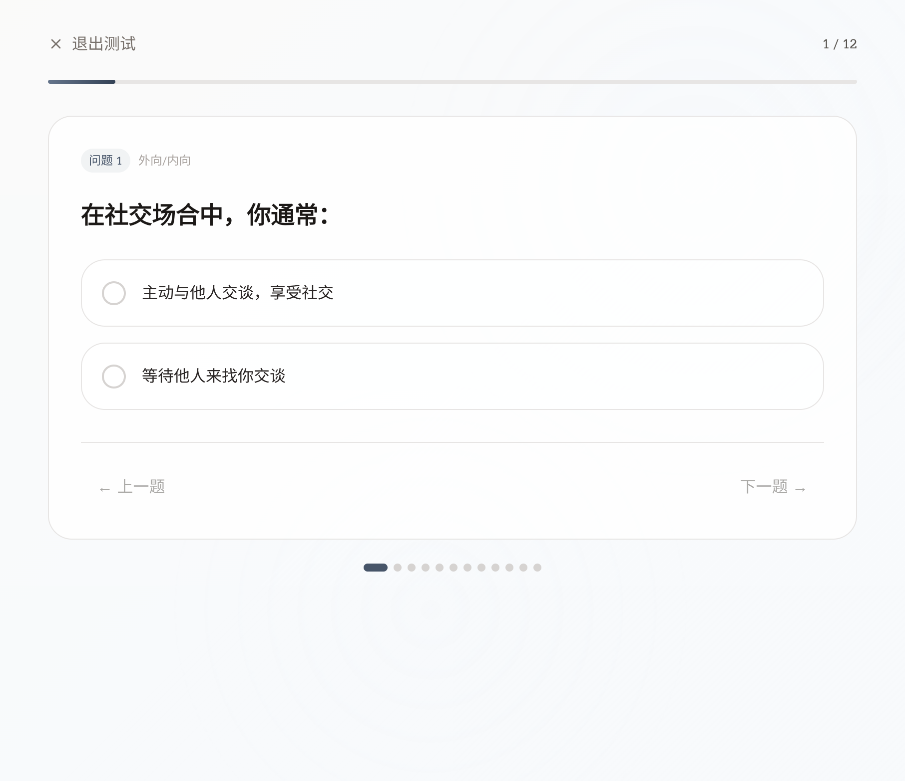
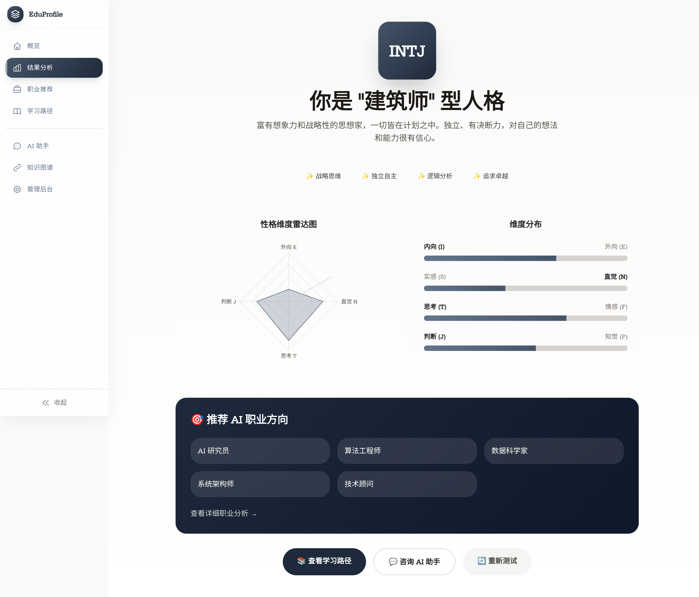
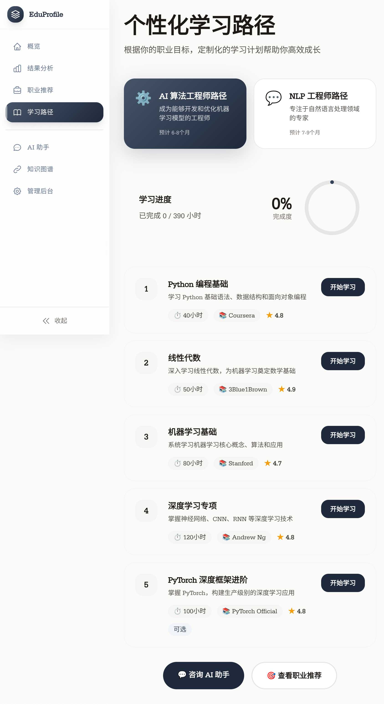
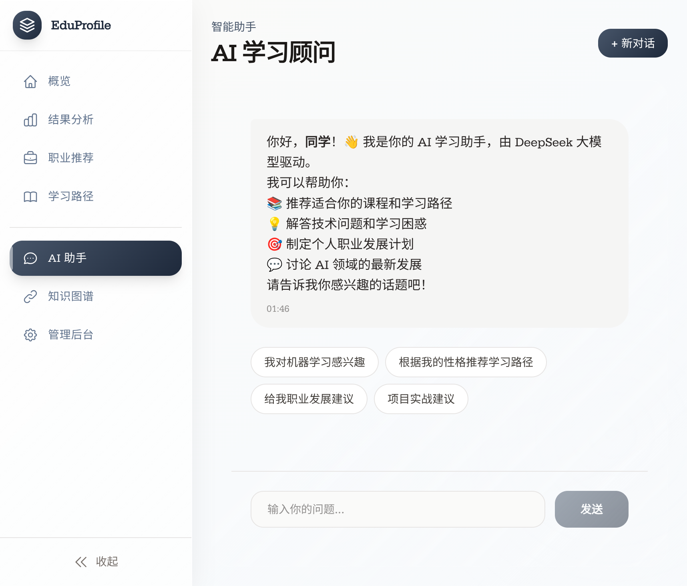
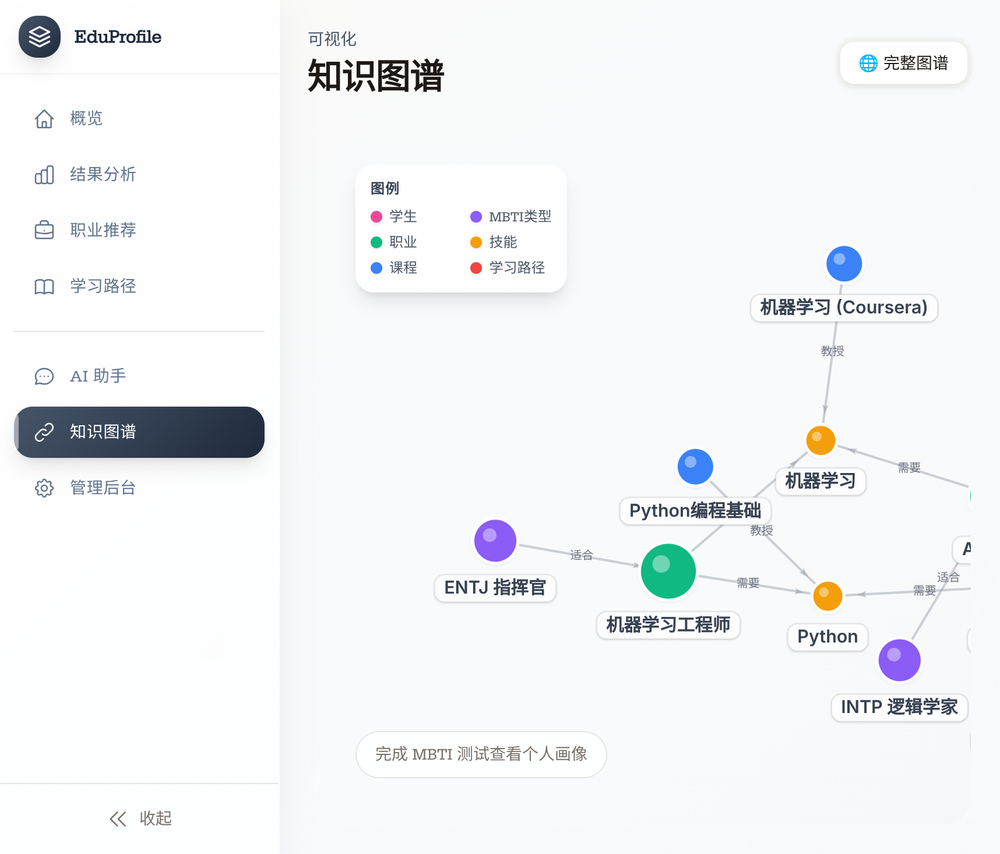
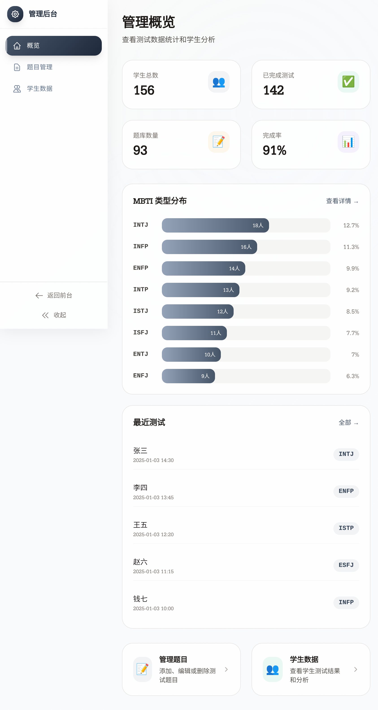

# 🚀 PathMind AI - 智能学习路径规划系统

<div align="center">


**基于 MBTI 性格测试的 AI 学习路径智能推荐系统**

*通过性格分析，为你匹配最适合的 AI 领域职业方向和个性化学习规划*

[](https://react.dev/)
[](https://www.typescriptlang.org/)
[](https://vitejs.dev/)
[](https://tailwindcss.com/)
[](https://neo4j.com/)
[](https://expressjs.com/)
[](https://www.framer.com/motion/)

</div>

---

## � 应用截图构

### 🏠 首页 - 液态玻璃设计
> 采用 Apple 风格的液态玻璃拟态设计，配合呼吸动画和模糊过渡效果



### 🧠 MBTI 测试选择
> Claude 风格左右分栏布局，支持快速/标准/深度三种测试模式



### 📝 测试进行中
> 多种题型支持：二选一、量表、情景、排序，实时进度保存



### 📊 测试结果分析
> 雷达图可视化展示四维度得分，详细性格解读



### 🎯 AI 职业推荐
> 基于性格类型智能匹配 AI 领域职业方向


### 📚 学习路径规划
> 个性化课程推荐，从入门到精通的完整学习路线



### 🤖 AI 智能助手
> DeepSeek 大模型驱动的 24/7 学习顾问



### � 知识始图谱
> Neo4j 图数据库实现技能、职业、课程关联可视化



### ⚙️ 管理后台
> 题目管理、学生数据分析、批量导入导出



---

## ✨ 核心功能

| 功能模块 | 描述 | 技术亮点 |
|---------|------|---------|
| 🧠 **MBTI 性格测评** | 支持快速(12题)/标准(28题)/深度(48题)三种测试 | 多题型、进度保存、断点续测 |
| 📊 **性格维度分析** | E/I、S/N、T/F、J/P 四维度雷达图可视化 | Recharts 动态图表 |
| 🎯 **AI 职业推荐** | 基于性格类型智能匹配 AI 领域职业 | Neo4j 图查询算法 |
| 📚 **学习路径规划** | 个性化课程推荐，完整学习路线 | 知识图谱关联推荐 |
| 🤖 **智能对话助手** | 24/7 学习顾问，上下文理解 | DeepSeek API 流式响应 |
| 🔗 **知识图谱可视化** | 技能、职业、课程关联展示 | react-force-graph-2d |
| ⚙️ **管理后台** | 题目 CRUD、批量导入、数据分析 | CSV 解析、图表统计 |

---

## 🛠️ 技术架构

```
┌─────────────────────────────────────────────────────────────┐
│                        Frontend                              │
│  React 19 + TypeScript + Vite + Tailwind CSS + Framer Motion │
├─────────────────────────────────────────────────────────────┤
│                        Backend                               │
│           Express + TypeScript + Neo4j Driver                │
├─────────────────────────────────────────────────────────────┤
│                       Database                               │
│                    Neo4j Graph Database                      │
├─────────────────────────────────────────────────────────────┤
│                      AI Service                              │
│                DeepSeek API (OpenAI Compatible)              │
└─────────────────────────────────────────────────────────────┘
```

### 前端技术栈

| 技术 | 版本 | 用途 |
|------|------|------|
| React | 19.2.0 | 核心 UI 框架 |
| TypeScript | 5.9.3 | 类型安全 |
| Vite | 7.2.4 | 构建工具 |
| Tailwind CSS | 4.1.17 | 原子化样式 |
| Framer Motion | 12.23.25 | 动画效果 |
| HeroUI | 2.8.5 | UI 组件库 |
| Recharts | 3.5.1 | 数据可视化 |
| react-force-graph-2d | 1.29.0 | 知识图谱 |
| Three.js | 0.181.2 | 3D 效果 |
| Lottie | 0.17.12 | 矢量动画 |

### 后端技术栈

| 技术 | 版本 | 用途 |
|------|------|------|
| Express | 4.18.2 | Web 框架 |
| TypeScript | 5.3.2 | 类型安全 |
| Neo4j Driver | 5.15.0 | 图数据库 |
| OpenAI SDK | 4.20.0 | AI API |
| Zod | 3.22.4 | 数据验证 |

---

## 🚀 快速开始

### 环境要求

- Node.js 18+
- Neo4j Desktop 或 Neo4j AuraDB
- DeepSeek API Key

### 安装步骤

```bash
# 1. 克隆项目
git clone https://github.com/shiro123444/PathMind-AI.git
cd PathMind-AI

# 2. 一键安装依赖
# Linux/Mac:
./setup.sh
# Windows:
.\setup.ps1

# 3. 配置环境变量
cp server/.env.example server/.env
# 编辑 server/.env:
# NEO4J_URI=bolt://localhost:7687
# NEO4J_USER=neo4j
# NEO4J_PASSWORD=your_password
# DEEPSEEK_API_KEY=your_api_key

# 4. 初始化数据库
cd server && npm run seed && cd ..

# 5. 启动服务
# 终端 1 - 后端 (端口 3001)
cd server && npm run dev

# 终端 2 - 前端 (端口 5173)
npm run dev
```

### 访问地址

| 服务 | 地址 |
|------|------|
| 前端应用 | http://localhost:5173 |
| 后端 API | http://localhost:3001/api |
| 健康检查 | http://localhost:3001/api/health |

---

## 📁 项目结构

```
PathMind-AI/
├── src/                      # 前端源码
│   ├── pages/                # 页面组件
│   │   ├── HomePageBPCO.tsx  # 首页
│   │   ├── MBTITestPage.tsx  # MBTI 测试
│   │   ├── ResultsPage.tsx   # 结果页
│   │   ├── CareerPage.tsx    # 职业推荐
│   │   ├── LearningPathPage.tsx # 学习路径
│   │   ├── AIAdvisor.tsx     # AI 助手
│   │   ├── GraphPage.tsx     # 知识图谱
│   │   └── admin/            # 管理后台
│   ├── components/           # 组件
│   │   ├── ui/               # 基础 UI
│   │   ├── mbti/             # MBTI 组件
│   │   ├── admin/            # 管理组件
│   │   └── animations/       # 动画组件
│   ├── theme/                # 主题配置
│   ├── types/                # 类型定义
│   └── services/             # API 服务
│
├── server/                   # 后端源码
│   └── src/
│       ├── routes/           # API 路由
│       ├── config/           # 配置
│       └── scripts/          # 脚本
│
└── public/                   # 静态资源
    ├── animations/           # Lottie 动画
    └── fonts/                # 字体文件
```

---

## 📚 API 文档

### MBTI 测试
```
POST /api/mbti/submit     # 提交测试结果
GET  /api/mbti/type/:code # 获取类型信息
GET  /api/mbti/types      # 获取所有类型
```

### 职业推荐
```
GET /api/careers/recommend/:mbtiCode  # 推荐职业
GET /api/careers/:careerId            # 职业详情
```

### 学习路径
```
GET /api/learning-path/career/:careerId    # 职业学习路径
GET /api/learning-path/recommend/:studentId # 个性化推荐
```

### AI 对话
```
POST /api/chat                        # 发送消息
GET  /api/chat/suggestions/:studentId # 问题建议
```

### 知识图谱
```
GET /api/graph/full              # 完整图谱
GET /api/graph/student/:studentId # 学生图谱
GET /api/graph/career/:careerId   # 职业图谱
```

---

## 🎨 设计特色

- **液态玻璃拟态** - Apple 风格的毛玻璃效果
- **专业蓝灰配色** - 沉稳专业的视觉体验
- **模糊过渡动画** - 页面切换的流畅体验
- **响应式设计** - 完美适配各种设备
- **中英文字体** - 思源宋体 + Serifa 组合

---

## 📄 License

MIT License © 2025 PathMind AI

---

<div align="center">

**如果这个项目对你有帮助，请给一个 ⭐ Star！**

</div>
